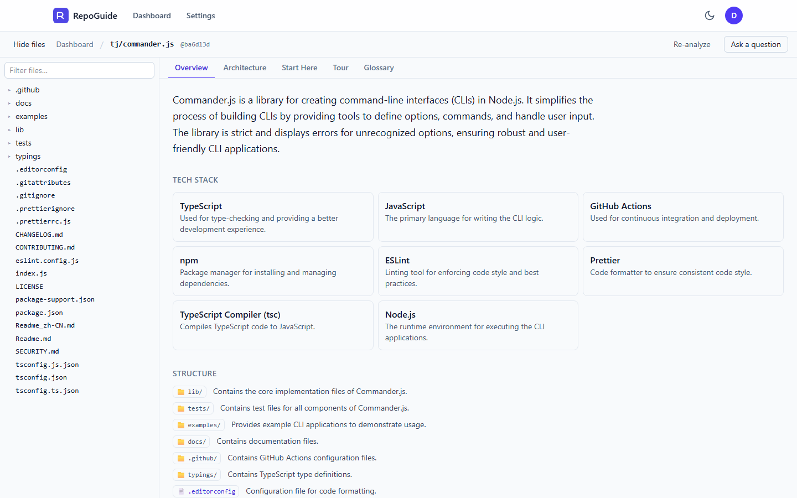
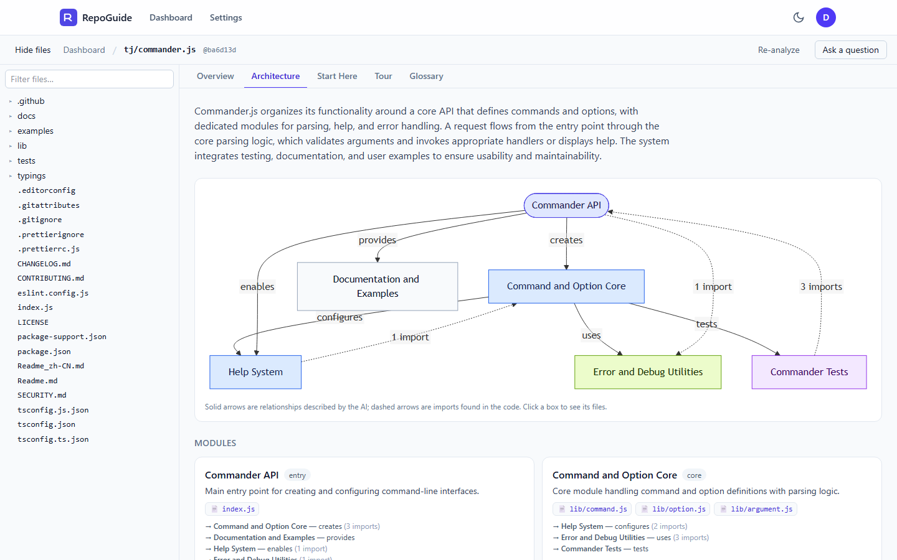
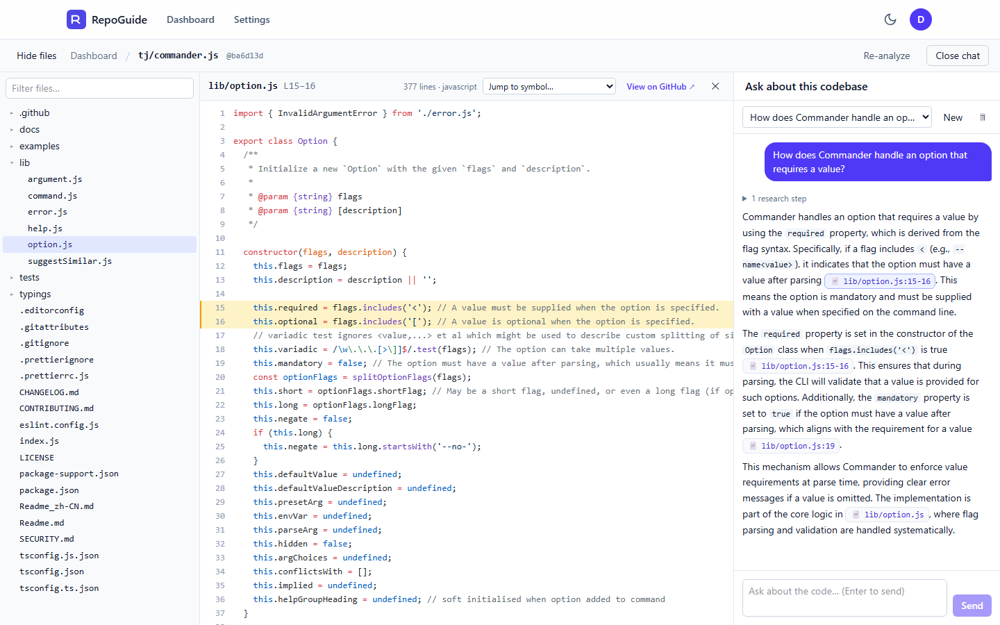
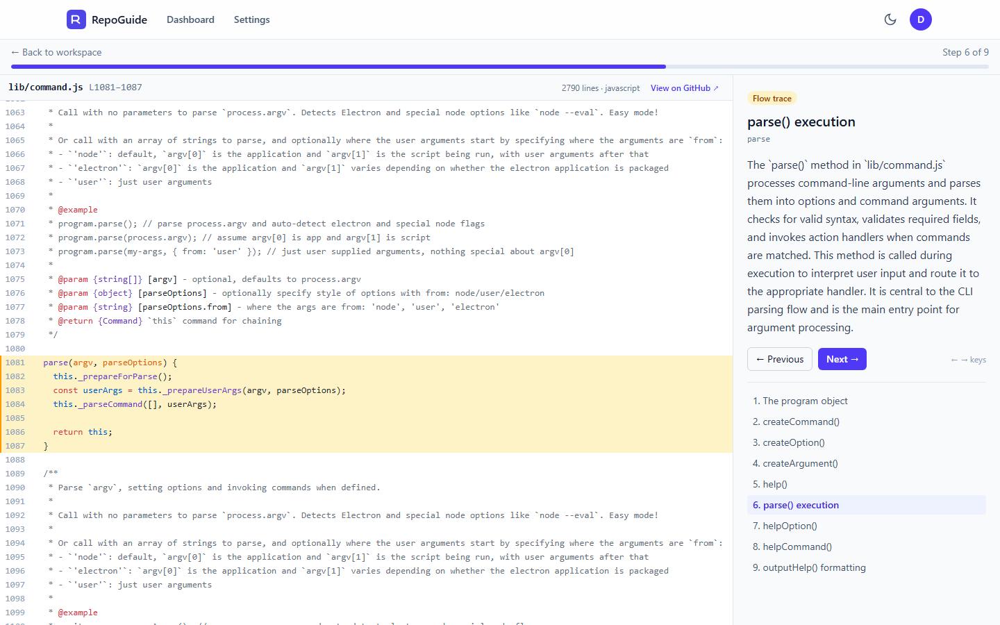
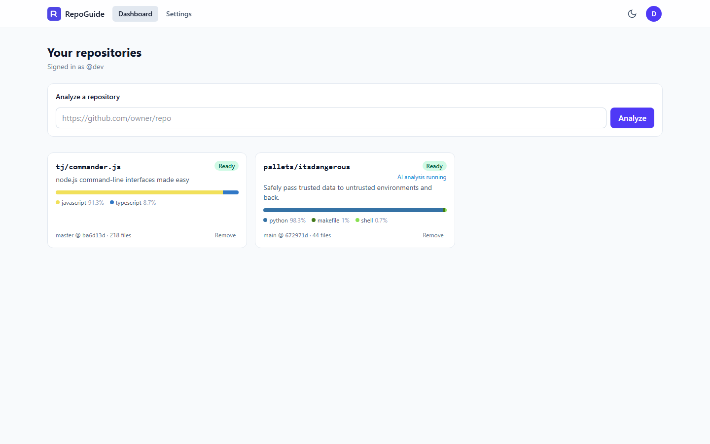
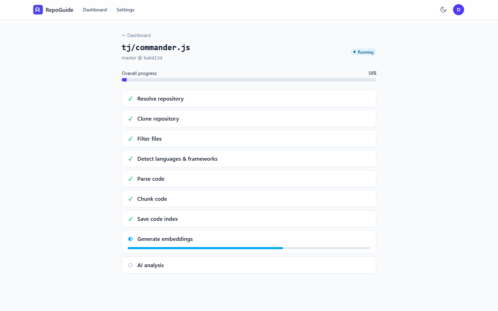
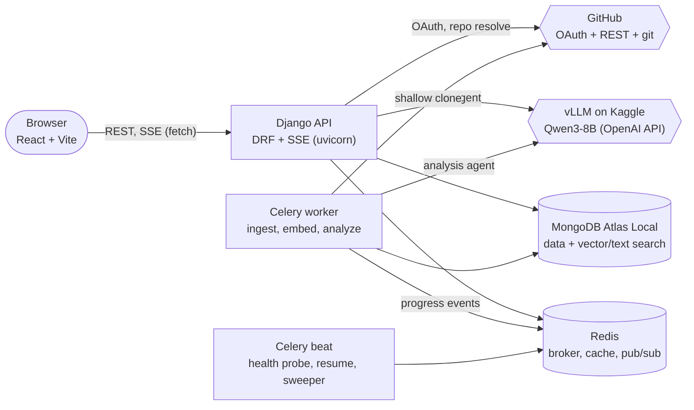

# RepoGuide

**An AI agent that onboards developers onto any GitHub codebase.** Paste a repository URL and
RepoGuide clones and analyzes it, then produces:

- a **Repo Overview**: what the project does, its stack, structure and how to run it;
- an interactive **Architecture Map** (Mermaid), built from the model's module graph plus the
  imports found in the code;
- a **"Start Here" reading list** of the most important files, in order;
- a **Guided Tour** that walks through the code, including a request/command flow trace, with
  a keyboard-driven tour mode;
- a **Glossary** of project-specific terms linked to their definitions;
- a **Q&A chat** whose answers stream in live and cite `path:start-end` ranges that open the
  code viewer.

The LLM is a **self-hosted open model** (Qwen3-8B on vLLM) running on a free Kaggle GPU
notebook. Everything is designed for that server to disappear at any time: analyses pause,
checkpoint and resume on their own, and the code stays browsable in the meantime.

## Screenshots

Real output for [`tj/commander.js`](https://github.com/tj/commander.js), produced by
`Qwen/Qwen3-8B` on the Kaggle vLLM server; every file and line reference was checked against the
code.
Regenerate them with `npm run screenshots` (see [`frontend/e2e/screenshots.spec.ts`](frontend/e2e/screenshots.spec.ts)).

**Workspace: overview, file tree and the AI-written summary**


**Architecture map: model-described relationships (solid) and imports found in the code (dashed)**


**Chat: a streamed answer whose citations open the exact lines**


**Tour mode: a flow-trace stop, with ←/→ navigation**


<details>
<summary>Dashboard and live ingestion progress</summary>




</details>

## Architecture



**Request path.** The SPA talks to the API over REST. Long-running work streams back as
Server-Sent Events: ingestion progress (Mongo is the source of truth, Redis pub/sub pushes live
updates) and chat answers (the agent runs in the API process and streams tokens, tool steps
and citations).

**Ingestion pipeline** (Celery chain): resolve the commit on GitHub → reuse the cache if this
exact commit was analyzed before → sandboxed shallow clone (no hooks, no LFS, no submodules,
no code execution) → filter (ignored dirs, lockfiles, binaries, minified, vendored, oversized)
→ detect languages and frameworks → tree-sitter parse (Python, JS/TS, Java, Go) → symbol-aware
chunks + dependency graph → store → embed (sentence-transformers on CPU) → the repository is
browsable → AI analysis.

**Analysis agent.** For each section a short research loop with read-only tools
(`search_code` hybrid vector + keyword search, `grep`, `read_file`, `list_directory`,
`get_symbol`, `get_dependencies`, `get_repo_metadata`), then one structured-output call
validated against a Pydantic schema, then reference repair: every path and line range is
checked against the file index, fixed (normalised path, clamped range, symbol lookup) or
removed. If the output is unusable after repair, the model is told exactly why and asked again.

**Chat agent.** Same tools, conversation history (recent turns verbatim, older turns
summarised), must look at the code before answering, cites `[path:start-end]`; invented
citations are stripped and only validated ones become clickable.

## Stack

| Layer | Tech |
|---|---|
| Backend | Python 3.13, Django 5.2, Django REST Framework, drf-spectacular |
| Database | MongoDB (`django-mongodb-backend` + PyMongo), Atlas Vector Search + Atlas Search via `mongodb-atlas-local` |
| Jobs | Celery + Redis (worker and beat) |
| LLM | vLLM OpenAI-compatible server on Kaggle 2× T4, via the `openai` SDK behind an `LLMClient` interface |
| Embeddings | `sentence-transformers` (`BAAI/bge-small-en-v1.5`) on CPU, swappable `EmbeddingProvider` |
| Parsing | tree-sitter (Python, JS/TS, Java, Go) |
| Frontend | React 19, TypeScript, Vite, React Router, TanStack Query, Tailwind CSS, Shiki, Mermaid |
| Tests | pytest (+ real MongoDB/Atlas Search), Vitest + Testing Library, Playwright |

## Quick start (Docker Compose)

```bash
cp .env.example .env          # set DJANGO_SECRET_KEY, MONGO_ROOT_PASSWORD, GitHub OAuth app, LLM_*
docker compose up --build
```

- Frontend: http://localhost:5173
- API docs (OpenAPI): http://localhost:8010/api/docs/
- Service health: http://localhost:8010/api/health · Model health: http://localhost:8010/api/llm/health

Create a GitHub OAuth App (callback `http://localhost:5173/api/auth/github/callback`) and put
its id/secret in `.env`; sign-in is GitHub-only.

### The model server

Follow [`kaggle/README.md`](kaggle/README.md) to start vLLM on a free Kaggle GPU notebook, then
point the running stack at the tunnel URL. No restart is needed:

```bash
docker compose exec backend python manage.py set_llm_url https://<your-tunnel>.trycloudflare.com
```

Any OpenAI-compatible server works. For local experiments, Ollama with a small tool-calling
model is enough (expect slower, simpler output):

```bash
docker compose exec backend python manage.py set_llm_url http://host.docker.internal:11434 --model qwen3:4b-instruct
```

### Production

`docker-compose.yml` is for development. To deploy behind HTTPS, use
[`docker-compose.prod.yml`](docker-compose.prod.yml) with
[`.env.production.example`](.env.production.example) and follow
[`docs/deployment.md`](docs/deployment.md): reverse proxy, model server, backups, security
checklist, sizing and troubleshooting.

### Demo data

```bash
docker compose exec backend python manage.py seed_demo --wait
```

This analyzes a small public repository (default `pallets/itsdangerous`) as a `demo` user, so
it is cached: anyone who analyzes the same URL gets the result instantly, free of the rate
limit. `--repo owner/name` picks another repository, `--add-to USERNAME` puts it on a user's
dashboard, and an optional `GITHUB_API_TOKEN` environment variable avoids GitHub's anonymous
API limit (60 requests/hour) while seeding.

## Configuration

Everything is configured with environment variables; [`.env.example`](.env.example) documents
each one. The important groups:

| Group | Variables |
|---|---|
| Django & auth | `DJANGO_SECRET_KEY`, `DJANGO_DEBUG`, `DJANGO_ALLOWED_HOSTS`, `FRONTEND_URL`, `JWT_*`, `AUTH_COOKIE_SECURE` |
| GitHub | `GITHUB_CLIENT_ID`, `GITHUB_CLIENT_SECRET`, `TOKEN_ENCRYPTION_KEYS` (Fernet, comma-separated for rotation) |
| Data | `MONGO_ROOT_USER`, `MONGO_ROOT_PASSWORD`, `MONGODB_DB` (or `MONGODB_URI`), `REDIS_URL` |
| Model | `LLM_BASE_URL`, `LLM_API_KEY`, `LLM_MODEL`, `LLM_*_TIMEOUT`, `LLM_MAX_RETRIES`, `LLM_DISABLE_THINKING`, `LLM_GUIDED_JSON`, `LLM_COST_PER_1K_*` |
| Embeddings | `EMBEDDING_PROVIDER` (`local` or `openai`), `EMBEDDING_MODEL`, `EMBEDDING_DIMENSIONS`, `EMBEDDING_WARMUP` |
| Agents | `ANALYSIS_MAX_ITERATIONS`, `ANALYSIS_TOKEN_BUDGET`, `ANALYSIS_MAX_WAIT_HOURS`, `CHAT_*` |
| Limits & jobs | `RATE_LIMIT_NEW_ANALYSES` (default `5/hour`), `RATE_LIMIT_CHAT_QUESTIONS` (default `30/hour`), `INGEST_MAX_*`, `INGEST_STALE_MINUTES`, `PRIVATE_ACCESS_RECHECK_HOURS` |
| Ports | `BACKEND_HOST_PORT`, `FRONTEND_HOST_PORT`, `MONGO_HOST_PORT`, `REDIS_HOST_PORT` |

## API overview

All endpoints live under `/api/` and return errors as `{"error": {"code", "message", "details"}}`.
The full schema is at `/api/docs/`.

| Area | Endpoints |
|---|---|
| Auth | `auth/github/login`, `auth/github/callback`, `auth/exchange`, `auth/refresh`, `auth/logout`, `me` |
| Repositories | `repos` (list, create), `repos/{id}` (get, remove from dashboard), `repos/{id}/reanalyze` |
| Ingestion | `repos/{id}/job`, `repos/{id}/job/stream` (SSE) |
| Code | `repos/{id}/tree`, `repos/{id}/files?path=&start=&end=` |
| Analysis | `repos/{id}/analysis`, `repos/{id}/analysis/{section}` |
| Chat | `repos/{id}/threads` (list, create), `…/threads/{tid}` (get, rename, delete), `…/messages`, `…/messages/stream` (SSE, POST) |
| Usage & model | `usage`, `repos/{id}/usage`, `llm/health`, `health` |

## Development

```bash
# Backend (unit tests need no services; tests marked `mongo` need `docker compose up mongo`)
cd backend
python -m venv .venv && .venv/Scripts/activate   # or: source .venv/bin/activate
pip install -r requirements-dev.txt
ruff check . && black --check . && pytest
pytest --cov=apps                                 # coverage (CI enforces >= 90%)

# Frontend
cd frontend
npm install
npm run lint && npm run format:check && npm run typecheck && npm test
npm test -- --coverage                            # coverage (CI enforces floors)
npx playwright install chromium && npm run e2e    # end-to-end tests against a mocked API
```

When MongoDB runs in Docker with credentials, point the tests at it with
`MONGODB_URI="mongodb://repoguide:<password>@localhost:27017/?directConnection=true&authSource=admin"`.

CI (GitHub Actions) runs ruff, black, pytest against real `mongodb-atlas-local` and Redis
services, ESLint, Prettier, tsc, Vitest with coverage floors, the production build, and the
Playwright suite.

## Design decisions and trade-offs

- **Built for a small model that can vanish.** Deterministic pre-analysis (README excerpt,
  scripts, entry points, most-imported files, import graph) is handed to the model up front,
  prompts are short and per section, every tool call is schema-validated with repair
  messages, and structured output is validated with Pydantic and repaired by re-prompting.
- **Checkpoint and resume.** A `ModelOfflineError` checkpoints the in-progress section (its
  conversation or research notes) and pauses the job as `waiting_for_model`; Celery beat resumes
  it when the health check sees the model again. Finished sections are never redone. Structured
  output is streamed so that a slow model is not mistaken for a dead one.
- **No hallucinated references.** Paths and line ranges are verified against the file index;
  the symbol index beats guessed line numbers; unverifiable citations are removed. The
  architecture map is a verified JSON graph rendered to Mermaid on the server (labels
  sanitised, rendered with `securityLevel: "strict"`), not model-written Mermaid.
- **Shared cache per commit.** A snapshot is keyed by `(repository, commit SHA)` and shared by
  all users, so re-opening a popular repository is instant and free. Re-analysis therefore only
  retries unfinished sections or moves to a newer commit; it never redoes finished work.
- **MongoDB for everything.** The Django ORM handles app entities; a thin PyMongo repository
  layer handles bulk chunk/blob/edge writes and `$vectorSearch` + `$search` aggregations merged
  with reciprocal rank fusion. Either search side can fail and search degrades to the other.
- **Tokens over dollars.** Every LLM and tool call is logged with tokens and latency; the
  dollar estimate uses configurable prices that default to zero for the self-hosted model.

## Security

- Repository content is untrusted data: it is never executed, tool output is wrapped in
  delimiters with escaping, and prompts tell the model never to follow instructions found in
  it. Tools are read-only and scoped to one repository.
- GitHub tokens are encrypted at rest (MultiFernet, rotatable) and never logged; structured
  logs redact secrets. Access tokens live in memory; refresh tokens are httpOnly cookies
  scoped to the auth endpoints, rotated on use and revocable.
- Private repositories: a cached analysis is only shown while GitHub confirms the user's access,
  re-checked periodically; losing access removes it from the user's dashboard.
- Per-user rate limits on new analyses and chat questions; clones are shallow, size- and file-count-limited and run
  without hooks or symlinks.

## Known limitations

- Answers are only as good as the model behind them: a 4B–8B model writes useful but
  sometimes shallow sections and can blur similar concepts. Every reference is verified, but
  the prose is not.
- tree-sitter symbol extraction covers Python, JavaScript/TypeScript, Java and Go; other
  languages fall back to line-based chunks (still searchable, without symbol-level links).
- Repository limits: 200 MB, 5,000 files, 500 KB per file (bigger files are skipped).
- Chat answers run inside the API process (one thread per active answer); a large deployment
  would move them to dedicated workers.
- Without a GitHub token, the GitHub API allows 60 requests per hour per IP; signed-in users
  use their own token.
- The Kaggle setup (vLLM on 2× T4) depends on Kaggle's session limits and may need the
  documented vLLM fallback version.

## Repository layout

```
backend/    Django project (config/) and apps: accounts, repos, ingestion, search, agents,
            analysis, chat, usage, llm, common; tests/ with fixtures and fakes
frontend/   React single-page app (src/), Vitest tests next to the code, e2e/ Playwright tests
kaggle/     vLLM model server notebook, script and guide
```
